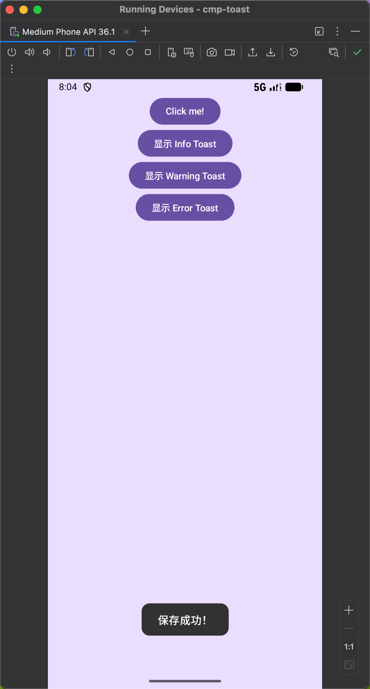
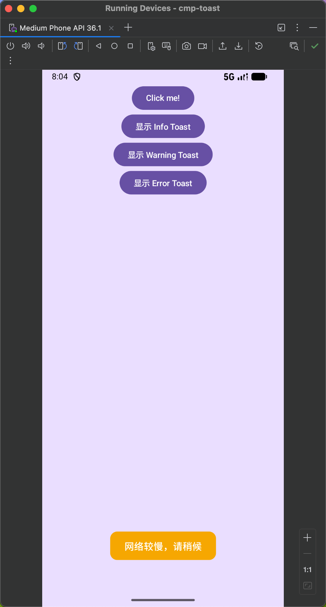
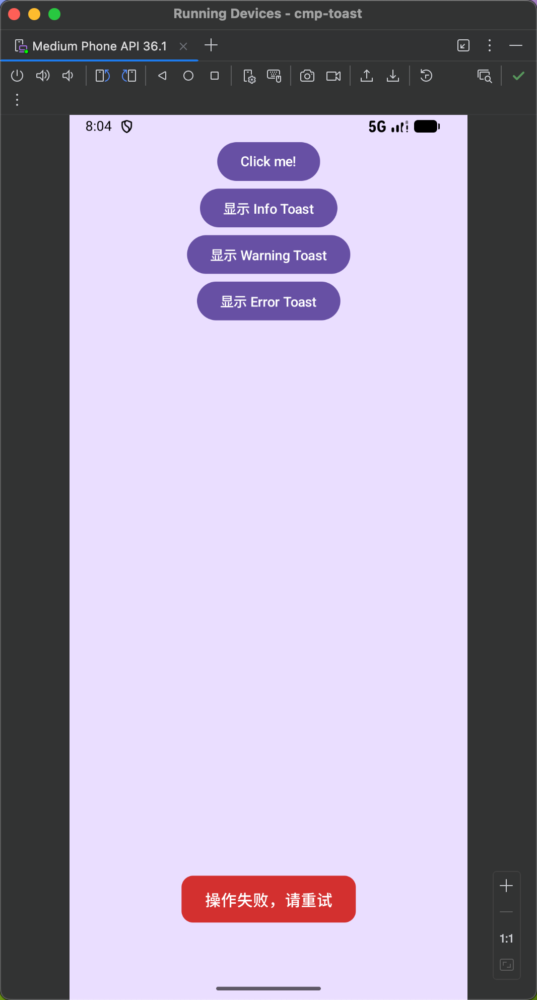

# CmpToast

kotlin compose multi-platform toast

---


```kotlin
MaterialTheme {
    Column(
        modifier = Modifier
            .background(MaterialTheme.colorScheme.primaryContainer)
            .safeContentPadding()
            .fillMaxSize(),
        horizontalAlignment = Alignment.CenterHorizontally,
    ) {
        Button(onClick = {
            ToastKit.info("保存成功！")
        }) {
            Text("显示 Info Toast")
        }

        Button(onClick = {
            ToastKit.warning("网络较慢，请稍候", ToastPosition.Bottom)
        }) {
            Text("显示 Warning Toast")
        }

        Button(onClick = {
            ToastKit.error("操作失败，请重试", position = ToastPosition.Top)
        }) {
            Text("显示 Error Toast")
        }
    }
    ToastHost()   // 全局 Toast 层
}
```





